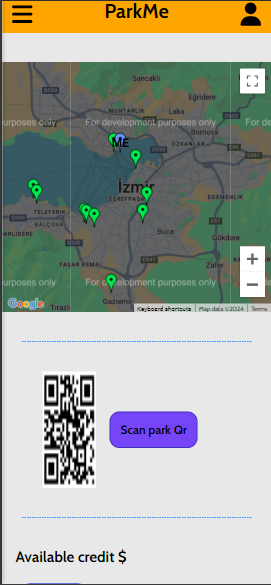

# ParkMe

## Introduction
ParkMe is a parking rental application that can work in any region you want and includes a payment infrastructure created with React and Django Rest Framework to rent unused parking spaces around you or in front of your home/office.


### Screenshots





### Setup Steps

1. **Clone the Repository**:

    Open your terminal or command prompt and run the following command to clone the repository from GitHub:

    ```bash
    git clone https://github.com/ismailerd1/ParkMe.git
    cd backend
    ```

2. **Create and Activate a Virtual Environment**:
   
    - For macOS/Linux:

      ```bash
      python3 -m venv venv
      source venv/bin/activate
      ```

    - For Windows:

      ```bash
      python -m venv venv
      venv\Scripts\activate
      ```

3. **Install Required Packages**:

    ```bash
    pip install -r requirements.txt
    ```
4. **Apply Database Migrations**:

   ```bash
    python manage.py migrate
    ```
5. **Start the development server**:
   
   ```bash
    python manage.py runserver
    ```

6. **Start the development server on react**:
   
   ```bash
    cd frontend
    npm run dev
    ```
   
7. **Open the Application in Your Browser**:

  Go to http://localhost:5173/register in your browser and start exploring Fluky!


## Contributing
If you would like to contribute, please submit a pull request or open an issue. I welcome all feedback!


## License
This project is licensed under the MIT License. For more information, see the LICENSE file.

### CONTACT
If you have any questions or need assistance, please feel free to reach out.
my e-mail: ismailerdogan2003@gmail.com
